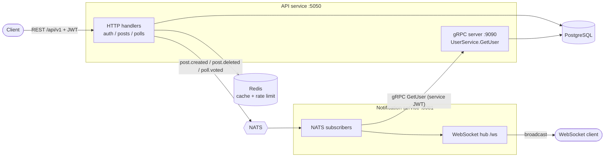

# Murmur API
[](https://github.com/oleg-morshel/murmur-api/actions/workflows/ci.yml)

An anonymous message board backend written in Go. Users register, publish posts (optionally anonymous), attach polls and vote. Other clients get real-time notifications over WebSocket.

**Stack:** Go · PostgreSQL · Redis · NATS · WebSocket (gorilla) · gRPC · JWT · Docker Compose · Swagger (OpenAPI)

## Features

- **Auth** — register / login / refresh / logout, JWT access + refresh tokens
- **Posts** — CRUD, pagination, anonymous posts (the author is hidden in REST and in WebSocket events)
- **Polls** — one poll per post, one vote per user
- **Caching** — Redis cache for the feed and single posts
- **Rate limiting** — 10 new posts per minute per user (Redis)
- **Real-time notifications** — a separate Notification Service consumes NATS events and broadcasts them over WebSocket
- **Service-to-service gRPC** — the Notification Service resolves author usernames through the API's gRPC server (JWT-authenticated)
- **API docs** — Swagger UI and a Postman collection

## Architecture



### Project layout

```
cmd/
  api/                 REST + gRPC server entrypoint
  notification/        NATS → WebSocket service entrypoint
internal/
  config/              env-based configuration
  core/                shared code: domain, errors, events, HTTP server/middleware, Redis, NATS, Postgres pool
  features/
    auth/              service · transport/http · repository/postgres
    posts/             service · transport/http · repository/postgres · cache
    polls/             service · transport/http · repository/postgres
  grpcserver/          gRPC server (UserService) with JWT interceptor
  grpcclient/          gRPC client with service-token interceptor
  ws/                  WebSocket hub and handler
pkg/logger/            slog-based logger with file output
proto/                 board.proto + generated code
migrations/            SQL migrations
docs/                  generated Swagger files + Postman collection
```

Each feature is split into `service` (business logic, depends on interfaces), `transport/http` (handlers, DTOs, routes) and `repository` (Postgres), which keeps layers independently testable.

## Getting started

### Prerequisites

- Go (version in `go.mod`)
- Docker with Docker Compose
- Optional: `protoc` (to regenerate gRPC code), `swag` (to regenerate Swagger docs), `golangci-lint`

### 1. Configure

```bash
cp .env.example .env
```

Fill in the empty values (see [Configuration](#configuration)). The Makefile reads `.env`, so the file must exist.

### 2. Start infrastructure and apply migrations

```bash
make env-up            # PostgreSQL, Redis, NATS
make env-port-forward  # exposes PostgreSQL on 127.0.0.1:5432
make migrate-up
```

### 3. Run the services (two terminals)

```bash
make murmur-run               # API on :5050, gRPC on GRPC_ADDR
make murmur-run-notification  # WebSocket on :8081
```

Start the API first: the Notification Service calls its gRPC server to enrich events. If the call fails, events are still delivered, just without the author's username.

### Useful URLs

| What | URL |
|------|-----|
| REST API | `http://localhost:5050/api/v1` |
| Swagger UI | `http://localhost:5050/swagger/index.html` |
| WebSocket | `ws://localhost:8081/ws` |

## Configuration

Environment variables (see `.env.example`):

| Variable | Description |
|----------|-------------|
| `HTTP_ADDR` | API listen address, e.g. `:5050` |
| `HTTP_SHUTDOWN_TIMEOUT`, `HTTP_READ_HEADER_TIMEOUT`, `HTTP_READ_TIMEOUT`, `HTTP_IDLE_TIMEOUT` | HTTP server timeouts |
| `POSTGRES_USER`, `POSTGRES_PASSWORD`, `POSTGRES_DB`, `POSTGRES_TIMEOUT` | PostgreSQL connection |
| `REDIS_HOST`, `REDIS_PORT`, `REDIS_PASSWORD`, `REDIS_DB` | Redis connection |
| `NATS_URL` | NATS server, e.g. `nats://localhost:4222` |
| `GRPC_ADDR` | gRPC server listen address (API), e.g. `:9090` |
| `GRPC_TARGET` | gRPC server address used by the Notification Service, e.g. `localhost:9090` |
| `JWT_SECRET` | HMAC secret, shared by the API and the Notification Service |
| `ACCESS_TTL`, `REFRESH_TTL` | Token lifetimes (Go durations) |
| `LOGGER_LEVEL` | `DEBUG`, `INFO`, ... |

## REST API

Base path: `/api/v1`. Full interactive documentation: Swagger UI (`/swagger/index.html`). Import the Postman collection from [`docs/postman`](docs/postman) — it stores tokens and IDs automatically, just run the folders in order.

| Method | Path | Auth | Description |
|--------|------|------|-------------|
| POST | `/auth/register` | – | Create an account, returns a token pair |
| POST | `/auth/login` | – | Log in, returns a token pair |
| POST | `/auth/refresh` | – | Exchange a refresh token for a new pair |
| POST | `/auth/logout` | – | Invalidate a refresh token |
| GET | `/auth/me` | Bearer | Current user |
| GET | `/posts?limit=&offset=` | – | List posts (default limit 20) |
| GET | `/posts/{id}` | – | Get a post (with its poll, if any) |
| POST | `/posts` | Bearer | Create a post (`anonymous: true` hides the author) |
| PUT | `/posts/{id}` | Bearer | Update own post |
| DELETE | `/posts/{id}` | Bearer | Delete own post |
| POST | `/posts/{id}/poll` | Bearer | Attach a poll (2–10 options) |
| POST | `/polls/{id}/vote` | Bearer | Vote (one vote per user) |

Errors share one shape: `{"message": "...", "error": "..."}`. Status codes: 400 validation, 401 unauthorized, 403 forbidden, 404 not found, 409 conflict, 429 rate limited, 500 internal.

## Real-time notifications

The API publishes events to NATS; the Notification Service subscribes and broadcasts them to every connected WebSocket client.

| NATS subject | WebSocket message |
|--------------|-------------------|
| `post.created` | `{"type":"post.created","post_id":…,"anonymous":…,"timestamp":…}` plus `author_id` and `author_username` for non-anonymous posts |
| `post.deleted` | `{"type":"post.deleted","post_id":…,"timestamp":…}` |
| `poll.voted` | `{"type":"poll.voted","poll_id":…,"option_id":…,"timestamp":…}` (the voter is never exposed) |

Quick check:

```bash
# with websocat (or any WebSocket client)
websocat ws://localhost:8081/ws
```

## gRPC

`proto/board.proto` defines `UserService.GetUser`. The API serves it on `GRPC_ADDR`; the Notification Service is its client. Every call must carry `authorization: Bearer <JWT>`: the server validates it with the same token parser as the REST layer, and the client signs a short-lived (1 minute) service token with the shared `JWT_SECRET`. Regenerate code with `make proto`.

## Testing and quality

```bash
make test              # unit tests
make test-integration  # + integration tests (needs Docker, uses testcontainers)
make test-cover        # coverage report
make lint              # golangci-lint v2
make swagger           # regenerate Swagger docs after changing annotations
```

- Unit tests are table-driven with hand-written mocks (services, HTTP handlers via `httptest`)
- Integration tests run the real repository against PostgreSQL in a throwaway container (`//go:build integration`)

## Design decisions and known limitations

- **NATS core (at-most-once).** Events are not persisted; if the Notification Service is down, events are lost. JetStream would add durability and replay.
- **WebSocket is open.** No authentication, any origin is accepted, and all events go to all clients. Fine for a public feed, not for private data.
- **Shared JWT secret.** The API and the Notification Service use one HMAC secret; internal calls use a reserved subject (`0`). A production setup would use mTLS or separate service credentials.
- **Rate limiter.** Fixed-window counter in Redis (10 posts/min per user). If Redis is unavailable, post creation is rejected (fail-closed).
- **Cache.** Feed is cached for 60 s and single posts for 5 min; the feed cache is invalidated when a post is created.
- **Fail-open enrichment.** If the gRPC call for the author's username fails, the WebSocket event is still sent without it.
- **Swagger UI is public** and served on the same port as the API; restrict or disable it in production.
